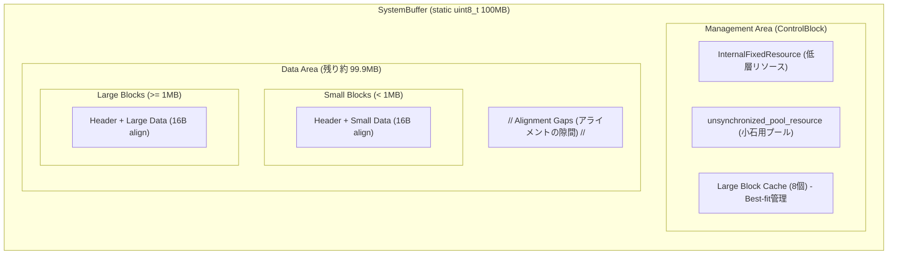
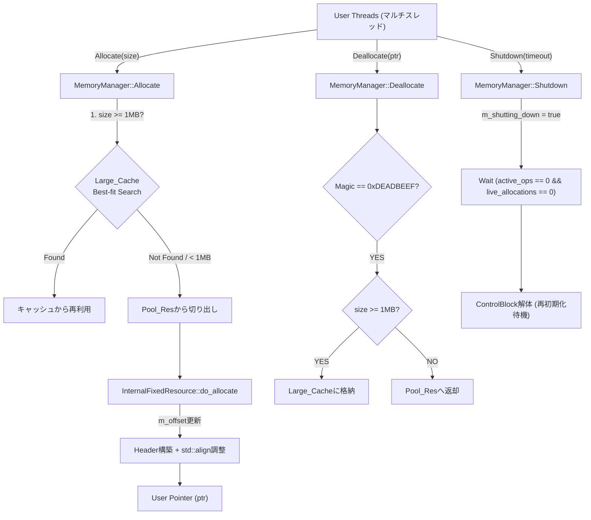

```mermaid
graph TD
    %% 全体のコンテナ（静的バッファ）
    subgraph SystemBuffer ["SystemBuffer (static uint8_t 100MB)"]
        direction TB

        %% 管理領域
        subgraph CB_Area ["Management Area (ControlBlock)"]
            direction LR
            Res_Base["InternalFixedResource (低層リソース)"]
            Pool_Res["unsynchronized_pool_resource (小石用プール)"]
            Large_Cache["Large Block Cache (8個) - Best-fit管理"]
        end

        %% データ領域
        subgraph Data_Area ["Data Area (残り約 99.9MB)"]
            direction TB
            
            subgraph Small_Alloc ["Small Blocks (< 1MB)"]
                S_Block1["Header + Small Data (16B align)"]
            end

            subgraph Large_Alloc ["Large Blocks (>= 1MB)"]
                L_Block1["Header + Large Data (16B align)"]
            end
            
            Align_Gap["// Alignment Gaps (アライメントの隙間) //"]
        end
    end
```

```mermaid
graph TD
    %% クラス外部（ユーザースレッド）
    User_Thread["User Threads (マルチスレッド)"]

    %% Allocateのフロー
    User_Thread -- "Allocate(size)" --> MM_Alloc["MemoryManager::Allocate"]
    MM_Alloc -- "1. size >= 1MB?" --> Cache_Check{"Large_Cache<br/>Best-fit Search"}
    Cache_Check -- "Found" --> L_Block_Reuse["キャッシュから再利用"]
    Cache_Check -- "Not Found / < 1MB" --> Pool_Alloc["Pool_Resから切り出し"]
    
    Pool_Alloc --> Fixed_Alloc["InternalFixedResource::do_allocate"]
    Fixed_Alloc -- "m_offset更新" --> Header_Setup["Header構築 + std::align調整"]
    Header_Setup --> User_Ptr["User Pointer (ptr)"]

    %% Deallocateのフロー
    User_Thread -- "Deallocate(ptr)" --> MM_Dealloc["MemoryManager::Deallocate"]
    MM_Dealloc --> Magic_Check{"Magic == 0xDEADBEEF?"}
    Magic_Check -- "YES" --> Size_Check{"size >= 1MB?"}
    Size_Check -- "YES" --> Cache_Put["Large_Cacheに格納"]
    Size_Check -- "NO" --> Pool_Dealloc["Pool_Resへ返却"]

    %% シャットダウンのフロー
    User_Thread -- "Shutdown(timeout)" --> MM_Shutdown["MemoryManager::Shutdown"]
    MM_Shutdown -- "m_shutting_down = true" --> Wait_Cond["Wait (active_ops == 0 && live_allocations == 0)"]
    Wait_Cond --> CB_Destroy["ControlBlock解体 (再初期化待機)"]
```